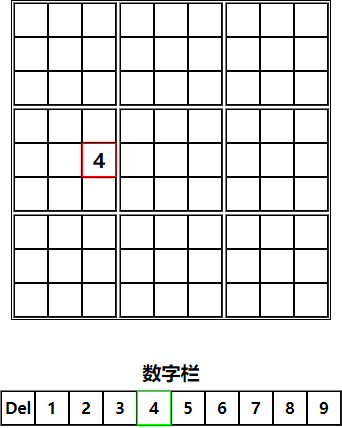

# HSudoku使用说明

点击数独中的单元格，若单元格边框变为红色则说明已选中。

选中单元格后在数字栏点击要输入的数字，若需要更改数字，可以直接点击新数字；若多输入了数字，可以点击`del`清除该单元格内的数字。

数字输入完毕后点击`开始计算`按钮，HSudoku系统将自动判断该数独是否有解，若有解，则会使用HSudoku引擎自动填充空的单元格。

可以使用`清空数独`按钮（单击即可）清空数独中每一个单元格的数字。
可以使用`还原数据`恢复您输入的未填充的数独。

HSudoku引擎虽为一人一日内开发出来，但我个人认为优化极好，正常算力电脑约3毫秒既可解出正常的一解数独，如出现`该数独大概率无解`字样的提示，**则说明内核已运行超过5秒，自动停止计算**，请检查您的设备性能是否正常，若有必要请联系开发人员（在[issues](https://github.com/Howardzhangdqs/howardzhangdqs.github.io/issues) 中留言），谢谢